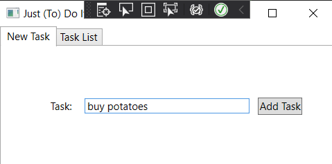
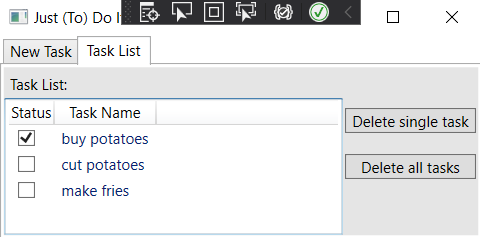

# Just(TO)DoIt
A simple Windows To Do app to become familiar with XAML. Nothing revolutionary here. I just think it is a good first project with WPF, so far I've been doing only console applications. 
You just simply enter a task you want to do like this:  
  
Then you can view all your tasks on a list.  
  
There you can mark your tasks as done, delete one task, or clear whole list.
The app now saves the task list to .xml file and loads it on the startup.
### To Do
This app is far from finished. I don't like the looks, and I want to add a feature that moves the task to the bottom of the list when marked as done. Also I need to add saving of status, that ain't working yet.